# Spenser - OUR DRUG DISPENSER

Линк към отбор "По жицата", HackTUES^365: https://www.hacktues.com/Teams/Details/1

Линк към презентация: https://prezi.com/dashboard/next/#/details/qeja4hnnzc6y/

## Здравейте, милички!

Система за подпомагане на хора, живеещи в старчески домове. Състои се от една главна станция, от която възрастните хора могат да получават
своите хапчета, и подстанции - notification base-ове. Те издават звуков и светлинен сигнал, когато наближи времето за прием на лекарства с
цел да подсетят човека, че трябва да ги приеме. Когато отиде до главната станция, той се чекира със своята ID карта и това е всичко :). Хап
четата падата в ръката на човека и той е свободен да продължи деня си без да мисли кога е следващият час, когато трябва да си вземе хапчет
та.

## ЧЕСТО ЗАДАВАНИ ВЪПРОСИ:
	
	A: Как ще бъде подсигурено възрастните хора да не губят своите идентификационни карти?
	B: Това може да бъде осъществено чрез използване на гривни вместо карти или чипове.

	A: Има ли начин да се разбере кога даден вид хапчета са свършили или са към привършване?
	В: Ще бъде въведена система със сензори, които засичат наличието на лекарства в дадения контейнер.

###### --------------------------------------------------------------------------------------------------------------------------------------------------------------------------------------------------

Link to team "Along the wire", HackTUES^365: https://www.hacktues.com/Teams/Details/1

Link to the presenttion: https://prezi.com/dashboard/next/#/details/qeja4hnnzc6y/

## Hello, Sweetie!

A system, designed to help the people in the rest homes. Its componends are following: there's a main station from which the elderly can simply get their pills, and substations - notification bases. The notifications contain a light and a sound signal that is indicating when the time for getting the pills is approaching.

###### --------------------------------------------------------------------------------------------------------------------------------------------------------------------------------------------------

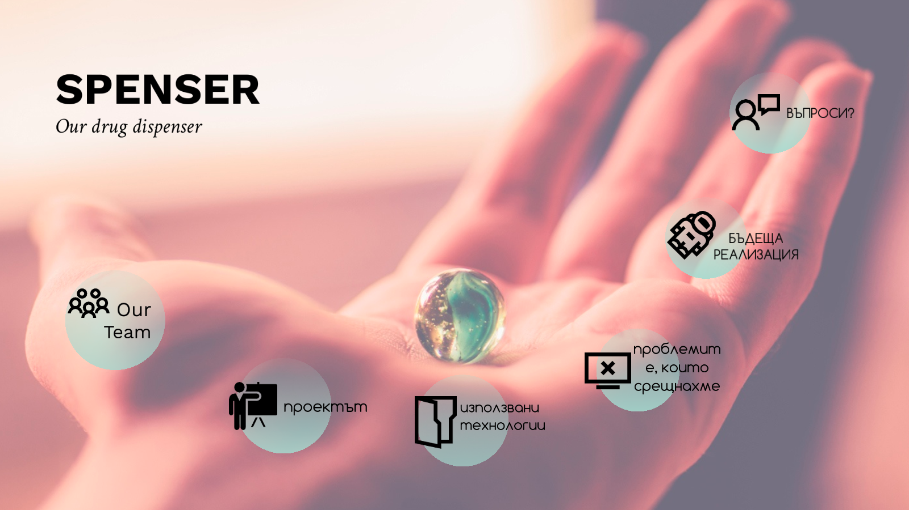
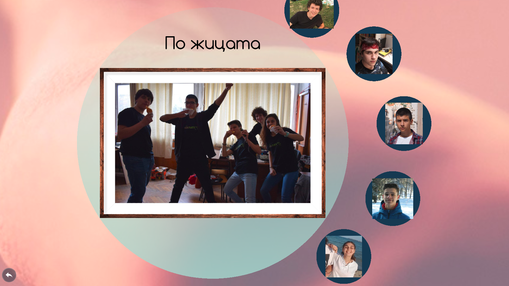
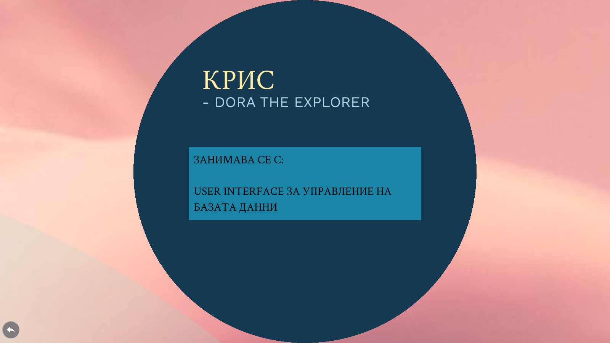
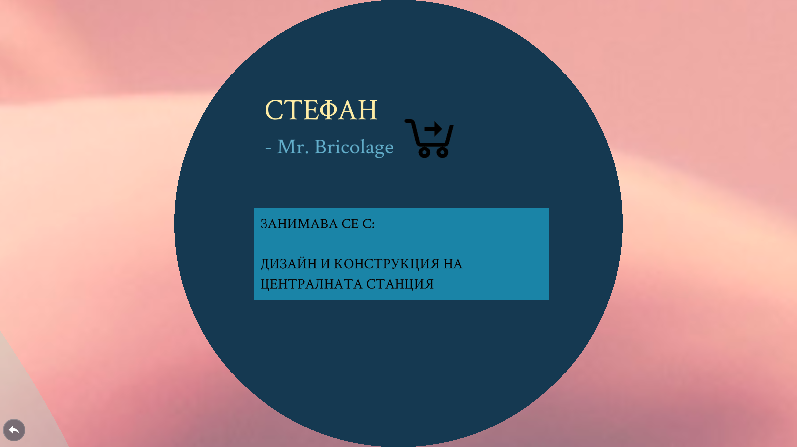
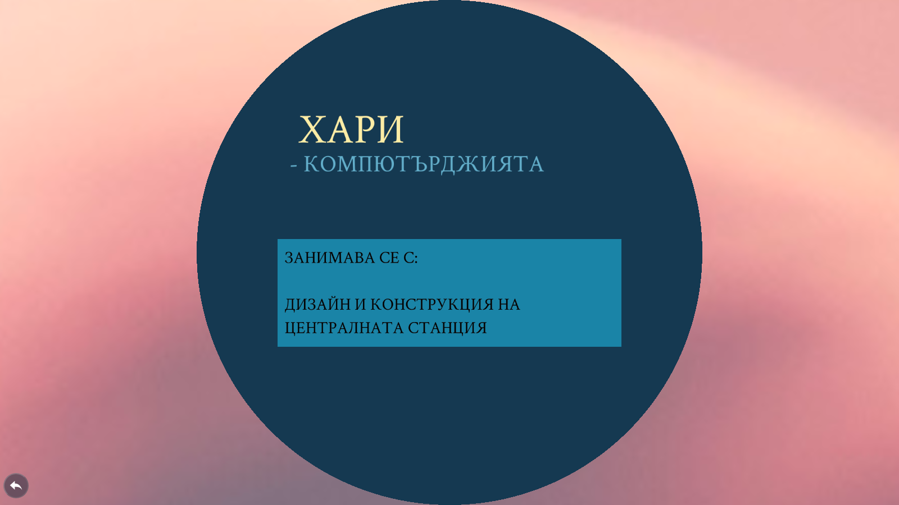
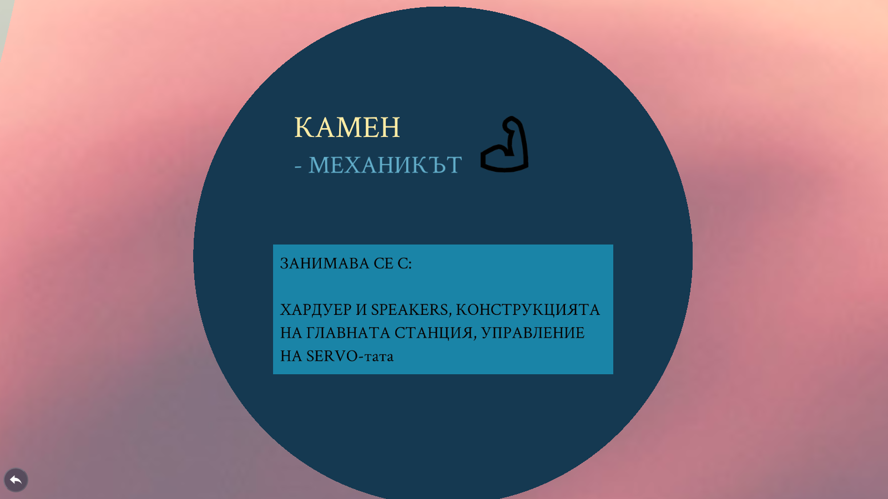
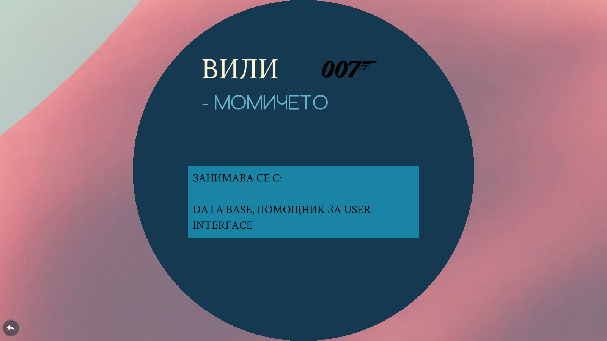
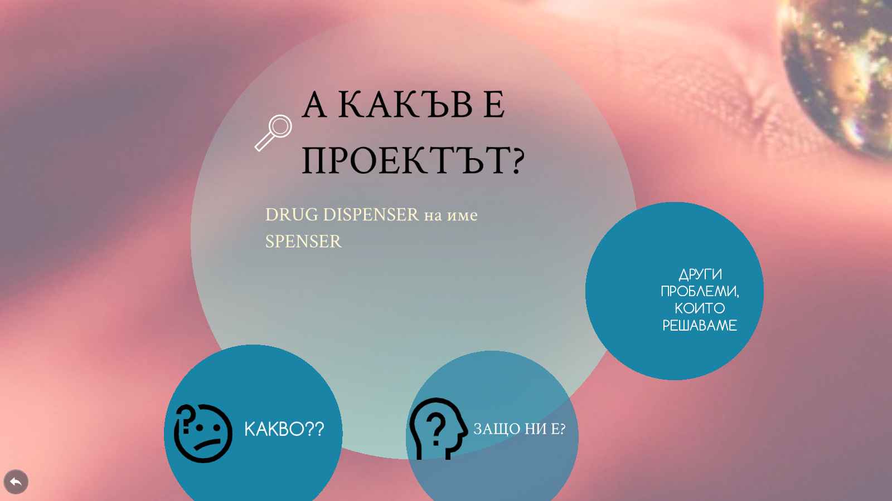

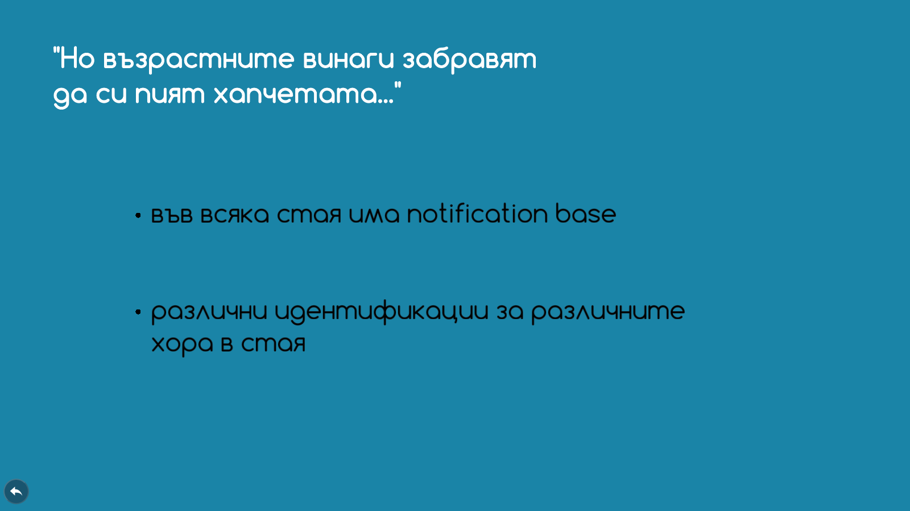
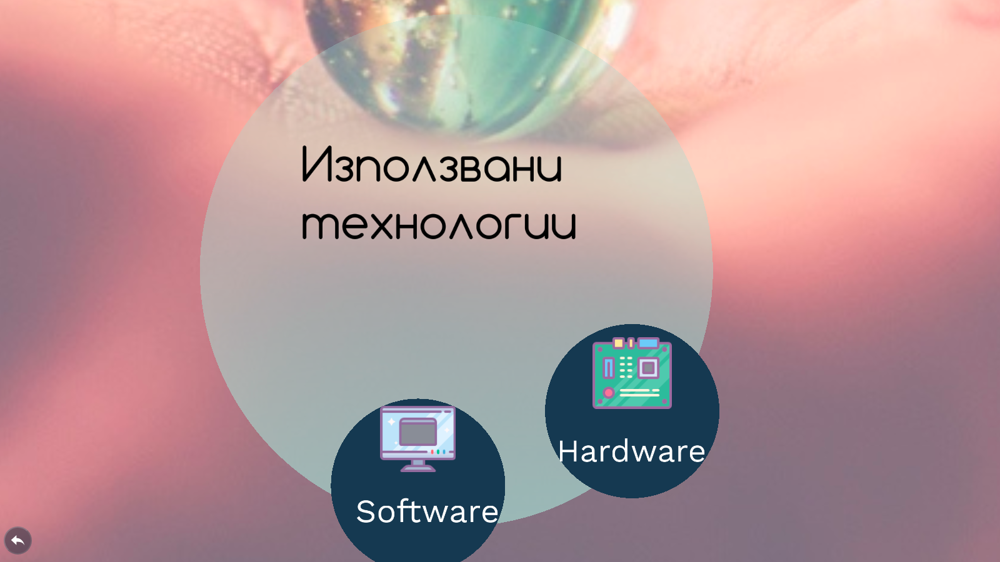
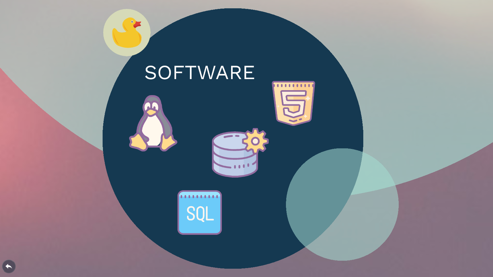
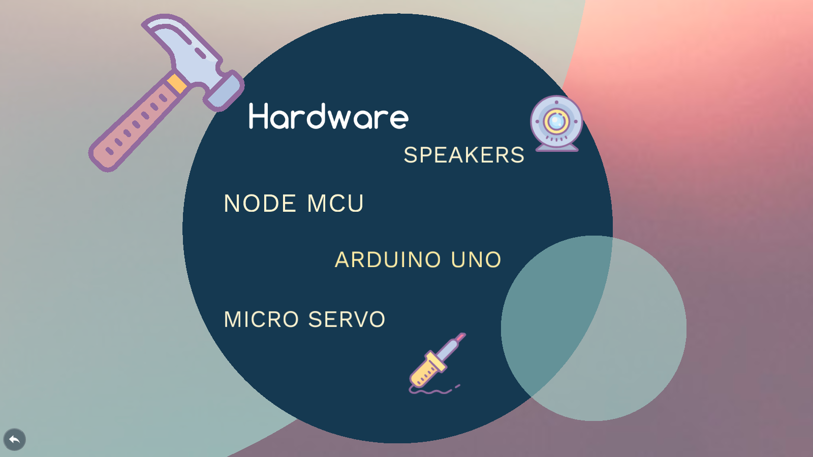
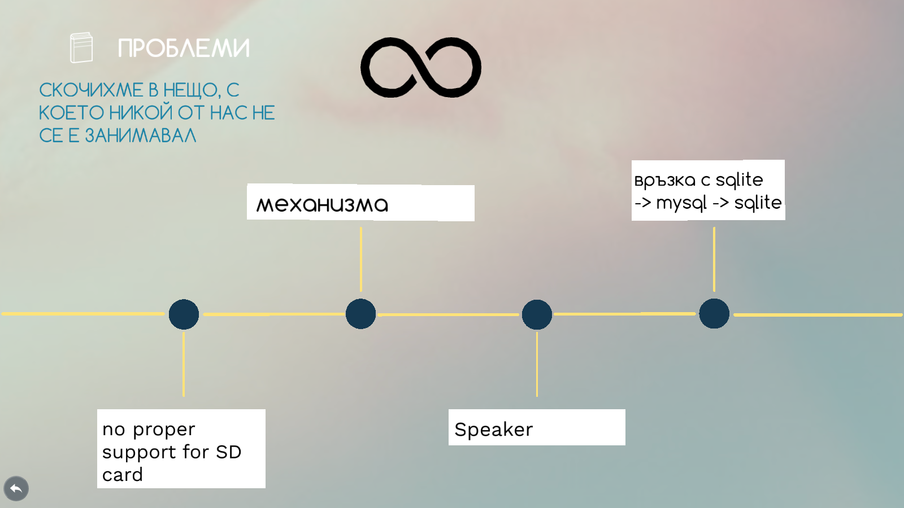
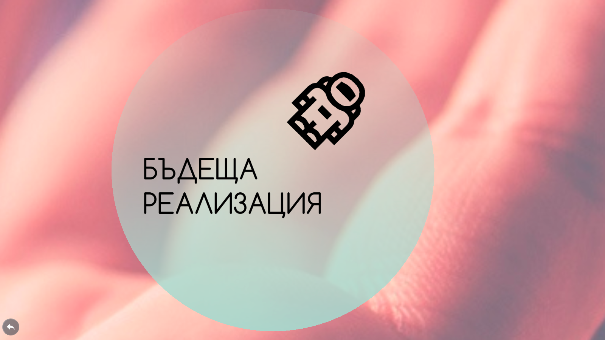
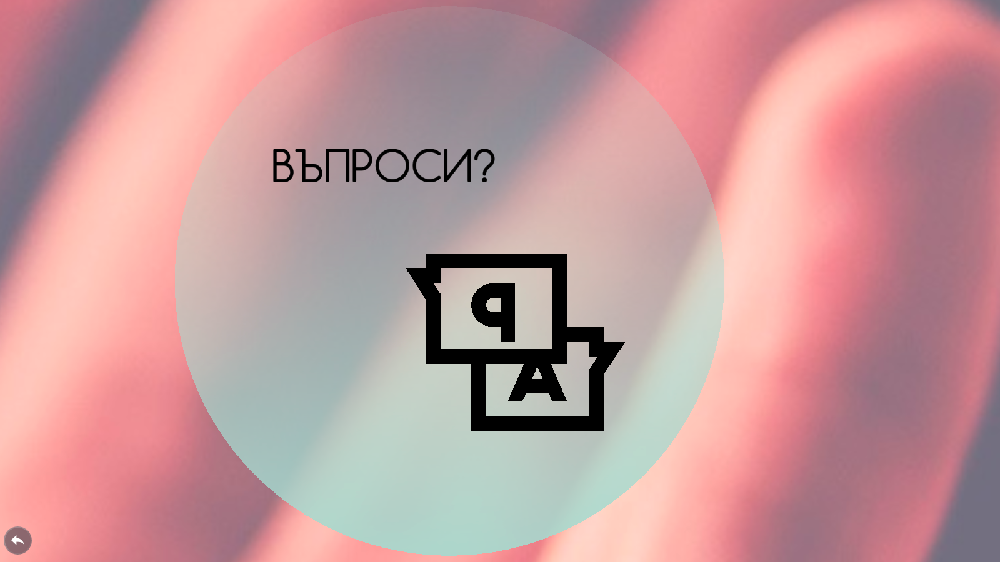

